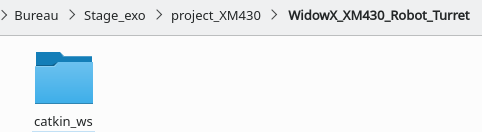
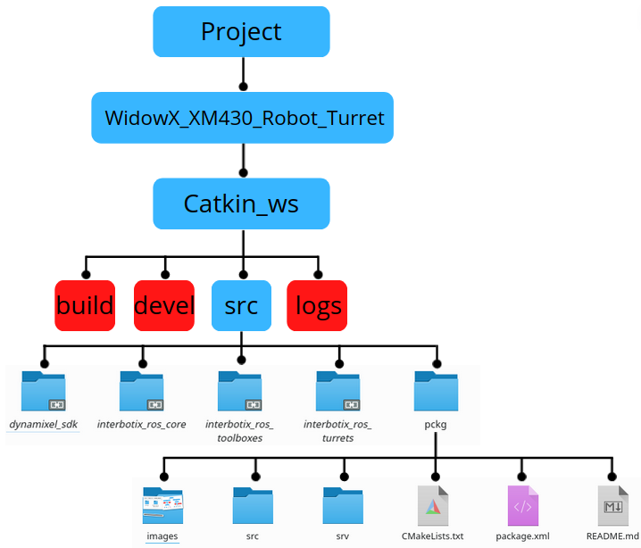

 # Package for WidowX XM430 Robot Turret

To be able to use this project it is very simple, you need the ROS environment to install on your computer. If you don't know how to click on this link, it's the UPC Barcelona tutorial: [Ros_tuto_upc](https://sir.upc.edu/projects/rostutorials/1-ROS_basic_concepts/index.html)


It is strongly advised to work with git, if you want to think about setting it up.
Once your computer is ready and working I advise you to create a project folder. In the project directory (or the name you gave it), create a new folder WidowX XM430 Robot Turret then in this one another under the name of catkin_ws and another one src. With the commande :
```
$mkdir -p WidowX_XM430_Robot_Turret/catkin_ws/src
```



After this create a git_repos, in this folder, create two folders (ioc and robot_turret).

Now open a terminal (Terminator) install following the previous tutorial. Why use Terminator? Terminator organizes terminals in a grid. It is useful because many terminals are usually needed simultaneously when working with ROS. 
Then using the command cd [path] go to the folder you created (git_repos/ioc). Once you are inside do:
`$ git clone [project git https links]` with this [link]( https://github.com/callofoscary/DIMECA-Project/tree/pruebas )
 
* Open a second terminal and go to the folder git_ repos/robot_turret 
* Clone this repos in that folder :  

    -[DynamixelSDK](https://github.com/ROBOTIS-GIT/DynamixelSDK.git)  
    -[interbotix_ros_core](https://github.com/Interbotix/interbotix_ros_core.git)  
    -[interbotix_ros_toolboxes](https://github.com/Interbotix/interbotix_ros_toolboxes.git)  
    -[interbotix_ros_turrets](https://github.com/Interbotix/interbotix_ros_turrets.git)  

*  Change to noetic branch in the interbotix repos :
```
$ cd interbotix_ros_core
$ git checkout noetic
$ cd interbotix_ros_toolboxes
$ git checkout noetic
$ cd interbotix_ros_turrets
$ git checkout noetic
```
* Drop the file CATKIN IGNORE
```
$ cd git-repos # or where you have clone the repos
$ cd interbotix_ros_core
$ rm interbotix_ros_xseries/CATKIN_IGNORE
$ cd ..
$ cd interbotix_ros_toolboxes
$ rm interbotix_xs_toolbox/CATKIN_IGNORE
```

So now, in an other terminator go to the folder (WidowX_XM430_Robot_Turret) and do this : 
```
$cd catkin_ws/src
$ ln -s where_git_repos_robot_turret_are_located/DynamixelSDK/ros/dynamixel_sdk
$ ln -s where_git_repos_robot_turret_are_located/interbotix_ros_core
$ ln -s where_git_repos_robot_turret_are_located/interbotix_ros_toolboxes
$ ln -s where_git_repos_robot_turret_are_located/interbotix_ros_turrets
$ ln -s where_git_ioc_are_located/pckg
```

Now you must install all requirements of packages that are missing, you can check with:

```
$ catkin build
```

If the compilation is successful, then you are ready to use the project.

Here is a diagram of what you should have on your computer before the compilation in blue and once the compilation is done the red folders are added to it(this is an example, so these are the names I decided to put, yours may be different but the structure remains the same):



## Execution step

Before running the programs, check that you have the ttyDXL port which is the one requested to be able to run the simulation programs, if you do not have this port either you configure it or you change it in the programs of the WidowX_XM430 folder. For me, the easiest way is to use this port.

As soon as the port configuration is done, open the pan_tilt.cpp file in the src folder of the pckg folder which is located in the src folder of catkin_ws of WidowX_XM430_Robot_Turret. This is where you choose whether to move the gazebo simulation robot or not. Choose the right class, the program is commented, read the comments to know which class corresponds to what. If you forget to set the  classes the program will run fine but nothing will happen. Normaly, you can use this code without the modify, you can use thanks to services.

Open a terminal, go to the WidowX_XM430 directory then catkin_ws, once here compile then make:
`$ catkin build `
`$ source devel/setup.bash`

Once this is done if you want to use the simulation mode:

`$roslaunch pckg pantilt.launch`

After that when the project starts, in the console you will be able to use the TELEOP node to move the robot, the slider interface for moving the pan and tilt module, 3d maps, 2d maps, camera POV or many thing more, they are publicated as topics for you to subscribe, we suggest exploring topic list and node introspection.

If all goes well, you will see the robot doing what you asked it to do. Now it's up to you, you can develop, modify or just use this project.

You can change maps editing the world launch setting in 

`~/pckg/launch/xturret_gazebo.launch`

instead of the default route you can change it to any gazebo map that you want, you can do this calling the argument at launch or simply modifiying the default setting.
`<arg name="world_name" default="$(find jackal_gazebo)/worlds/jackal_race.world" />`

